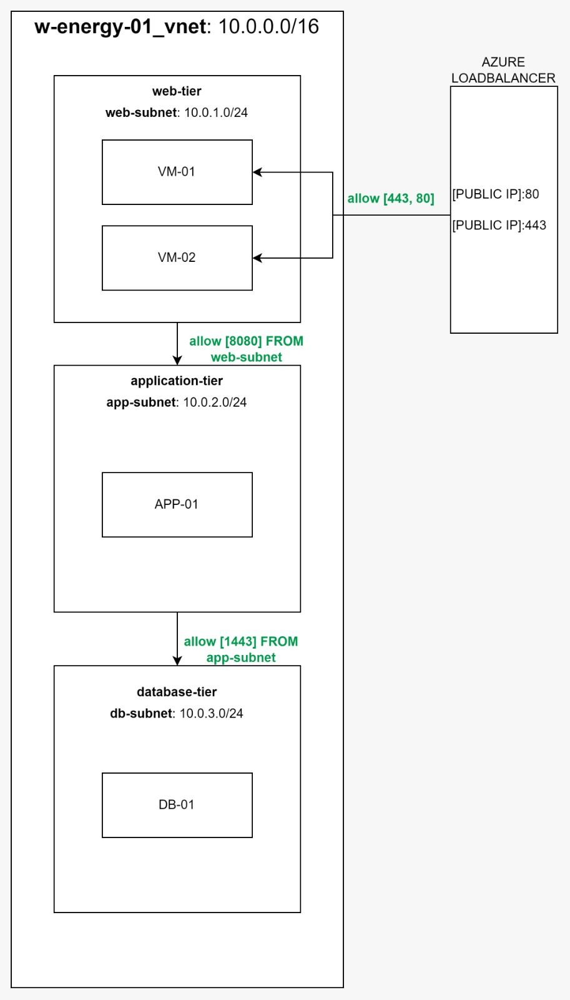
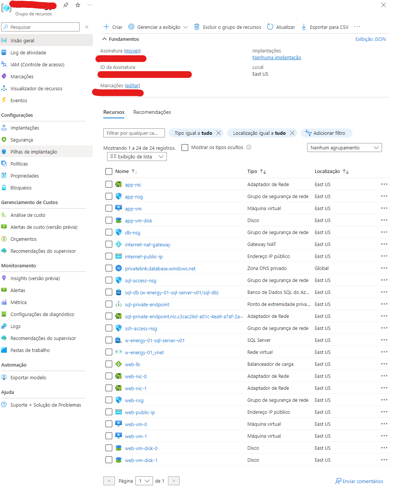

# W-Energy-01

Assignment description: Azure Infrastructure Automation with Terraform

Objective: Automate the deployment of a scalable web application in Azure using Terraform.
Task:

1. Infrastructure Requirements:

   - A Virtual Network (VNet) with subnets for web, application, and database tiers.
   - Two Virtual Machines (VMs) in the web tier with a Load Balancer.
   - A VM in the application tier.
   - An Azure SQL Database in the database tier.
   - A Network Security Group (NSG) with appropriate rules for each tier.

2. Automation:

   - Write Terraform scripts to deploy the above infrastructure.
   - Ensure the infrastructure is highly available and scalable.

3. Documentation:

   - Provide a README file explaining the Terraform scripts.
   - Include a cost estimate for the deployed infrastructure.

4. Deliverables:
   - [Terraform scripts](./infrastructure/azure/)
   - [README file](./README.md) with:
     - setup instructions
     - cost estimation.
   - [Screenshot of the deployed resources](#deployed-resources) in the Azure portal.

## Prerequisites

- Azure account
- Terraform installed
- Azure CLI installed and authenticated

## Setup Instructions

1. **Clone the repository:**

   ```bash
   git clone https://github.com/maxwell-silva/w-energy-01.git
   cd infrastructure/azure
   ```

2. **Initialize Terraform:**

   ```bash
   terraform init
   ```

3. **Set up variables:**
   Create the `terraform.tfvars` file with your Azure region, resource group name, admin username, and passwords.

4. **Test:**

   ```bash
   terraform plan
   ```

5. **Deploy the infrastructure:**

   ```bash
   terraform apply
   ```

After you just need to wait and check you azure account after process end

**IMPORTANT:** DON`T FORGOT TO DESTROY AT END

## Documentation

### Scripts Explanations

- [Terraform scripts](./infrastructure/azure/)
  - [00-vnet](./infrastructure/azure/00-vnet/) - Vitual Network and subnets
  - [01-nsg](./infrastructure/azure/01-nsg/) - Security rules between subnets
  - [02-nat-gateway](./infrastructure/azure/02-nat-gateway/) - Internet access
  - [10-db-tier](./infrastructure/azure/10-db-tier/) - DB Tier
  - [10-app-tier](./infrastructure/azure/20-app-tier/) - APP Tier
  - [30-web-tier](./infrastructure/azure/30-web-tier/) - WEB Tier



### Cost Estimation

Recomended:

- **Virtual Network:** $4.00
- **Virtual Machines:**
  - Standard_DS1_v2: ~$55/month per VM X 3
- **Azure SQL Database:**
  - S1 tier: ~$30/month
- **Load Balancer:** ~$23.25/month
- **Public IPs:** ~$2.92/month per IP X 2
- **Private Link:** ~7.30/month

**total:** ~ 235/month

## Deployed resources



## TODOs (enhancements)

- **Add a New Subnet:** Set up a new subnet to enable external access, enhancing the network’s organization and security.

- **Deploy a Management Virtual Machine:** Introduce a virtual machine specifically for managing the environment. This will centralize control over administrative tasks, monitoring, and maintenance.

- **Set Up CI/CD Processes:** Use the newly created management virtual machine to roll out continuous integration and continuous deployment processes. This step will help automate updates and maintenance, ensuring the environment remains up-to-date without constant manual oversight.

- **Implement Auto-scaling for App and Web Tiers:** Configure auto-scaling for the app and web layers to efficiently manage resource use and maintain performance during varying load conditions.

- **Define Access Protocols for the Application Layer:** Establish clear access protocols for the application layer if needed to secure and manage traffic flow, ensuring only authorized interactions are allowed.
